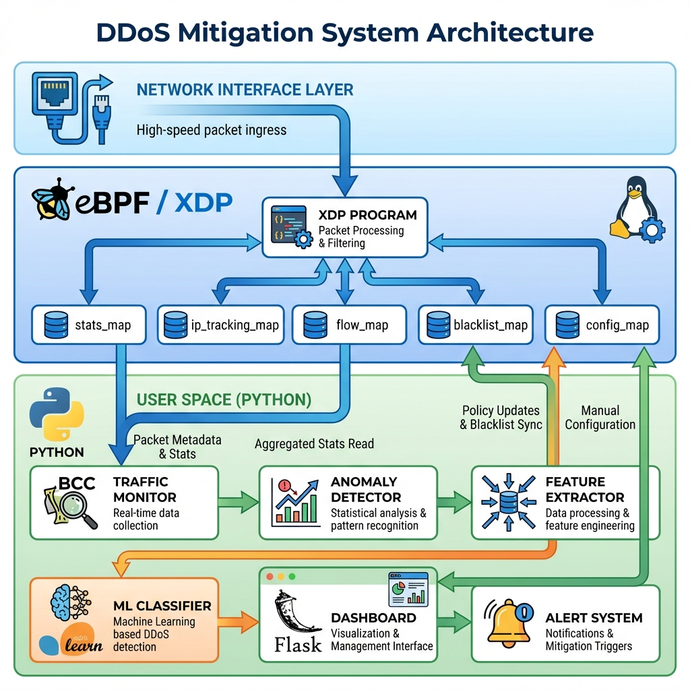
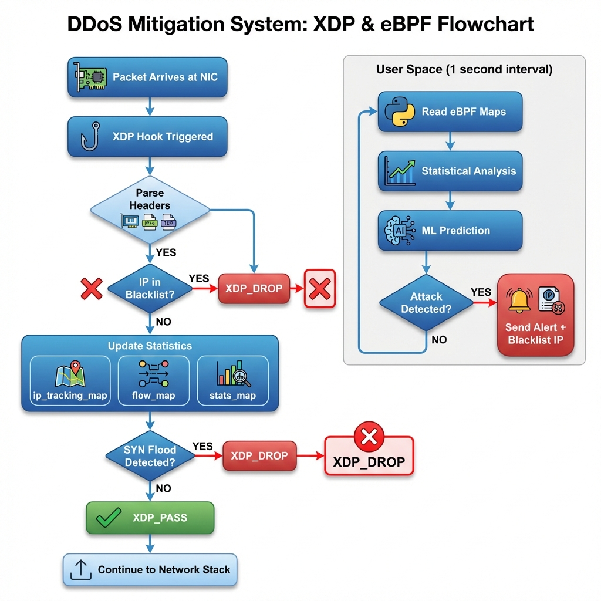
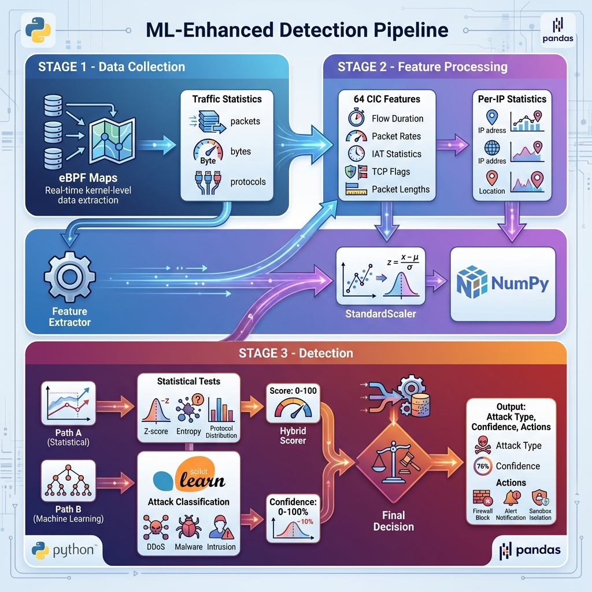
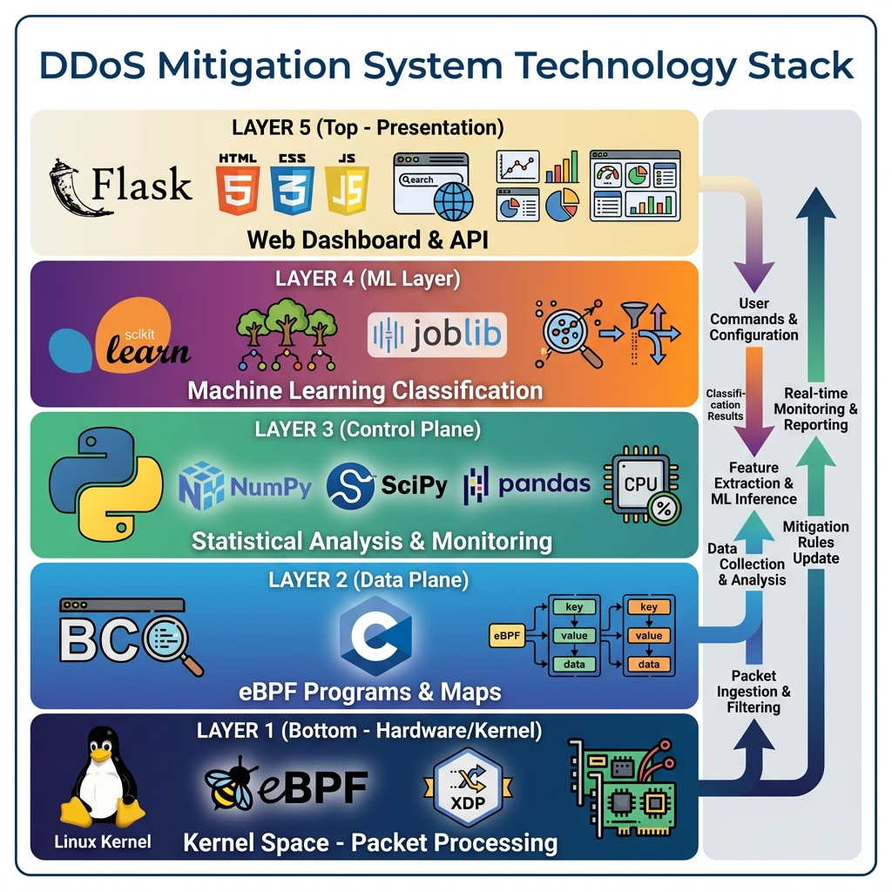

# DDoS Mitigation System - Architecture Diagrams & Flowcharts

This document contains all the architecture diagrams, flowcharts, and visual representations of the Rapid-Corona DDoS Mitigation System.

---

## 📊 Diagram Index

1. [System Architecture Diagram](#1-system-architecture-diagram)
2. [Packet Processing Flowchart](#2-packet-processing-flowchart)
3. [ML Detection Pipeline](#3-ml-detection-pipeline)
4. [Technology Stack Layers](#4-technology-stack-layers)
5. [Detection Decision Tree](#5-detection-decision-tree)
6. [Real-time Sequence Diagram](#6-real-time-sequence-diagram)

---

## 1. System Architecture Diagram



### Overview
This diagram shows the complete system architecture with three main layers:

**Network Interface Layer (Top)**
- Entry point for all network packets
- High-speed packet ingress from NIC

**Kernel Space - eBPF/XDP Layer (Middle - Blue)**
- **XDP Program**: Packet processing and filtering at kernel level
- **eBPF Maps**: Shared memory between kernel and user space
  - `stats_map`: Per-CPU global statistics
  - `ip_tracking_map`: Per-IP packet counters
  - `flow_map`: 5-tuple flow tracking
  - `blacklist_map`: Blocked IP addresses
  - `config_map`: Runtime configuration
- **Linux Kernel**: Tux penguin logo representing kernel space

**User Space - Python Layer (Bottom - Green/Orange)**
- **Traffic Monitor** (BCC): Loads XDP programs, reads eBPF maps
- **Anomaly Detector**: Statistical analysis and pattern recognition
- **Feature Extractor**: Converts traffic to ML features
- **ML Classifier** (scikit-learn): Random Forest attack classification
- **Dashboard** (Flask): Web interface for monitoring
- **Alert System**: Notifications and mitigation triggers

### Data Flow
1. Packets arrive at network interface
2. XDP hook processes packets in kernel
3. Statistics stored in eBPF maps
4. User space reads maps via BCC
5. Analysis and detection in Python
6. Alerts and blacklist updates
7. Dashboard displays real-time status

### Technologies Used
- **eBPF/XDP**: Kernel-level packet filtering
- **BCC**: Python bindings for eBPF
- **Python**: Control plane logic
- **scikit-learn**: Machine learning classification
- **Flask**: Web dashboard framework
- **Linux Kernel**: Operating system foundation

---

## 2. Packet Processing Flowchart



### Overview
Detailed flowchart showing how each packet is processed through the system, with two parallel flows: kernel space (left) and user space (right).

### Kernel Space Flow (Left - Fast Path)

**Step 1: Packet Arrives at NIC**
- Network Interface Card receives packet
- Triggers XDP hook immediately

**Step 2: XDP Hook Triggered**
- eBPF program `xdp_ddos_filter` executes
- Processing time: ~1 microsecond

**Step 3: Parse Headers**
- Extract Ethernet header
- Extract IP header (src_ip, dst_ip, protocol)
- Extract TCP/UDP header (ports, flags)

**Step 4: Blacklist Check**
- **Decision**: Is source IP in blacklist?
  - **YES** → `XDP_DROP` (packet dropped immediately)
  - **NO** → Continue processing

**Step 5: Update Statistics**
- Update `ip_tracking_map` (per-IP counters)
- Update `flow_map` (5-tuple flow stats)
- Update `stats_map` (global statistics)

**Step 6: SYN Flood Detection**
- **Decision**: SYN count > 1000 for this IP?
  - **YES** → `XDP_DROP` (drop packet)
  - **NO** → Continue

**Step 7: XDP_PASS**
- Packet allowed through
- Continues to network stack

**Step 8: Continue to Network Stack**
- Normal Linux networking processes packet

### User Space Flow (Right - 1 Second Interval)

**Step 1: Read eBPF Maps**
- Python program reads statistics via BCC
- Aggregates per-CPU data

**Step 2: Statistical Analysis**
- Calculate packet rates (PPS, BPS)
- Check protocol distribution
- Calculate IP entropy
- Compare to baseline

**Step 3: ML Prediction**
- Extract 64 CIC features
- Run Random Forest classifier
- Get attack type and confidence

**Step 4: Attack Detection Decision**
- **Decision**: Is attack detected?
  - **YES** → Send alert + Blacklist IP
  - **NO** → Loop back to Step 1

### Performance Metrics
- **Kernel processing**: <1 microsecond per packet
- **User space analysis**: 1-second intervals
- **Throughput**: 5M+ packets per second
- **Drop rate**: 10M+ pps for blacklisted IPs

---

## 3. ML Detection Pipeline



### Overview
Three-stage pipeline showing how raw traffic data is transformed into attack detection decisions using machine learning.

### STAGE 1: Data Collection (Blue)

**eBPF Maps**
- Real-time kernel-level data extraction
- Zero-copy access to packet metadata

**Traffic Statistics**
- Total packets and bytes
- Protocol distribution (TCP/UDP/ICMP)
- Packet rates (PPS, BPS)

**Per-IP Statistics**
- Individual source IP tracking
- Flow counts per IP
- SYN/ACK/UDP counters

### STAGE 2: Feature Processing (Purple)

**Feature Extractor**
- Converts raw statistics to ML features
- Sliding window aggregation (10 seconds)

**64 CIC Features**
- **Flow Duration**: Microseconds
- **Packet Rates**: Packets/sec, Bytes/sec
- **IAT Statistics**: Inter-arrival times (mean, std, min, max)
- **TCP Flags**: SYN, ACK, FIN, RST, PSH, URG counts
- **Packet Lengths**: Forward/backward statistics

**StandardScaler (NumPy)**
- Normalize features to zero mean, unit variance
- Uses pre-trained scaler from model training
- Ensures consistent feature ranges

### STAGE 3: Detection (Orange/Red)

**Path A: Statistical Analysis**
- Baseline Profiler compares to learned normal traffic
- Statistical Tests:
  - **Z-score**: Standard deviation from mean
  - **Entropy**: IP diversity measurement
  - **Protocol Distribution**: TCP/UDP/ICMP ratios
- **Output**: Statistical Score (0-100)

**Path B: Machine Learning**
- Random Forest Classifier (100 trees, depth 15)
- scikit-learn implementation
- Attack Classification:
  - SYN_Flood
  - UDP_Flood
  - DrDoS_UDP/DNS/LDAP/NTP
  - HTTP_Flood
  - BENIGN
- **Output**: ML Confidence (0-100%)

**Hybrid Scorer**
- Combines statistical and ML scores
- Weighted decision algorithm
- Confidence thresholds

**Final Decision**
- **Attack Type**: Specific attack classification
- **Confidence**: Combined confidence score
- **Actions**: Alert, blacklist, log

### Technologies Used
- **Python**: Orchestration
- **NumPy**: Numerical operations
- **pandas**: Data manipulation
- **scikit-learn**: Random Forest classifier
- **joblib**: Model persistence

---

## 4. Technology Stack Layers



### Overview
Five-layer architecture showing all technologies used in the system, from hardware to presentation.

### LAYER 1: Hardware/Kernel (Bottom - Dark Blue)

**Linux Kernel**
- Tux penguin logo
- Foundation of the system
- Provides eBPF infrastructure

**eBPF**
- Extended Berkeley Packet Filter
- Kernel-level programmability
- Safe, verified execution

**XDP**
- eXpress Data Path
- Earliest packet processing point
- Line-rate packet filtering

**Network Interface Cards**
- Physical network hardware
- Packet ingress/egress

**Purpose**: Kernel Space - Packet Processing

### LAYER 2: Data Plane (Blue)

**BCC (BPF Compiler Collection)**
- Python bindings for eBPF
- Compile and load eBPF programs
- Access eBPF maps

**C Programming Language**
- eBPF programs written in C
- Compiled to eBPF bytecode

**eBPF Maps**
- Hash maps for key-value storage
- Per-CPU arrays for statistics
- Shared memory between kernel/user space

**Purpose**: eBPF Programs & Maps

### LAYER 3: Control Plane (Green)

**Python**
- Main programming language
- Orchestrates all components
- Version 3.8+

**NumPy**
- Numerical computing
- Array operations
- Statistical calculations

**SciPy**
- Scientific computing
- Advanced statistics
- Signal processing

**pandas**
- Data manipulation
- CSV loading (CIC dataset)
- DataFrame operations

**psutil**
- System monitoring
- CPU/memory tracking
- Process management

**Purpose**: Statistical Analysis & Monitoring

### LAYER 4: ML Layer (Purple/Orange)

**scikit-learn**
- Machine learning library
- Random Forest classifier
- Feature scaling (StandardScaler)
- Model evaluation metrics

**Random Forest**
- Ensemble learning method
- 100 decision trees
- Attack classification

**joblib**
- Model serialization
- Save/load trained models
- Efficient persistence

**Feature Extraction**
- 64 CIC-compatible features
- Real-time computation
- Sliding window aggregation

**Purpose**: Machine Learning Classification

### LAYER 5: Presentation (Top - Light)

**Flask**
- Python web framework
- REST API server
- Lightweight and fast

**HTML5/CSS3/JavaScript**
- Frontend technologies
- Modern web standards
- Responsive design

**Web Browser**
- User interface
- Real-time dashboard
- Port 5000

**Charts & Dashboards**
- Metrics visualization
- Alert history
- Live statistics

**Purpose**: Web Dashboard & API

### Data Flow (Side Panel)

**Upward Flow (Blue Arrow)**
- Packet ingestion and filtering
- Data collection and analysis
- Feature extraction and ML inference
- Mitigation and reporting
- Real-time monitoring and reporting

**Downward Flow (Purple/Orange Arrows)**
- User commands and configuration
- Classification results
- Mitigation updates (blacklist)

---

## 5. Detection Decision Tree


### Overview
Comprehensive decision tree showing the hybrid detection logic that combines statistical analysis and machine learning.

### Root: Traffic Analysis

Central starting point with magnifying glass icon representing continuous traffic monitoring.

### Branch 1: Statistical Analysis (Left - Blue Path)

**Test 1: Calculate PPS**
- Measure packets per second
- **Decision**: PPS > 2000?
  - **YES** → Add 50 points to score
  - **NO** → Continue to next test

**Test 2: Check Protocol Distribution**
- Calculate TCP/UDP/ICMP ratios
- **Decision**: Abnormal ratio detected?
  - **YES** → Add 15 points to score
  - **NO** → Continue to next test

**Test 3: Calculate IP Entropy**
- Shannon entropy of source IPs
- **Decision**: Entropy < 3.0?
  - **YES** → Add 20 points (concentrated sources)
  - **NO** → Continue to next test

**Test 4: Detect SYN Flood**
- Count SYN packets per IP
- **Decision**: Excessive SYN packets?
  - **YES** → Add 25 points to score
  - **NO** → Complete statistical analysis

**Statistical Score Output**: 0-100 points

### Branch 2: ML Analysis (Right - Orange Path)

**Step 1: Extract 64 Features**
- Flow duration, packet counts
- Packet rates (bytes/sec, packets/sec)
- IAT statistics
- TCP flags
- Packet length statistics

**Step 2: Scale Features**
- Apply StandardScaler
- Normalize to zero mean, unit variance

**Step 3: Random Forest Prediction**
- 100 decision trees vote
- scikit-learn classifier
- Attack type classification

**ML Confidence Output**: 0-100%

### Merge Point: Hybrid Scoring Algorithm (Center - Purple)

**Decision Matrix**:

| Rule | Condition | Result |
|------|-----------|--------|
| 1 | Statistical ≥70 **AND** ML ≥85 | **HIGH CONFIDENCE ATTACK** |
| 2 | Statistical ≥70 **OR** ML ≥85 | **MEDIUM CONFIDENCE** |
| 3 | Combined Score ≥60 | **PROBABLE ATTACK** |
| 4 | Both Low | **BENIGN** |

### Final Output (Bottom)

**RED: ATTACK DETECTED**
- High confidence attack identified
- **Actions**:
  - Send alert (HIGH severity)
  - Blacklist source IPs
  - Log attack details
  - Update dashboard

**YELLOW: SUSPICIOUS**
- Medium confidence, requires monitoring
- **Actions**:
  - Send alert (MEDIUM severity)
  - Monitor closely
  - Increase logging
  - No immediate blocking

**GREEN: BENIGN**
- Normal traffic, no threat detected
- **Actions**:
  - Continue normal operation
  - Update baseline statistics
  - No alerts

### Scoring Examples

**Example 1: Large UDP Flood**
- Statistical: PPS=50000 (+50), Abnormal UDP (+15), Low entropy (+20) = **85**
- ML: DrDoS_UDP detected with 92% confidence
- **Result**: HIGH CONFIDENCE ATTACK (Rule 1)

**Example 2: SYN Flood**
- Statistical: Excessive SYN (+25), Moderate PPS (+25) = **50**
- ML: SYN_Flood detected with 95% confidence
- **Result**: MEDIUM CONFIDENCE (Rule 2)

**Example 3: Flash Crowd**
- Statistical: High PPS (+50), High entropy (-10) = **40**
- ML: BENIGN with 78% confidence
- **Result**: BENIGN (Rule 4)

---

## 6. Real-time Sequence Diagram


### Overview
UML-style sequence diagram showing the temporal flow of data through the system with precise timing information.

### Swimlanes (Left to Right)

**LANE 1: Network Interface**
- NIC icon with Ethernet symbol
- Entry point for all packets

**LANE 2: XDP/eBPF**
- eBPF logo and kernel icon
- Kernel-level packet processing

**LANE 3: Traffic Monitor**
- Python and BCC logos
- User-space eBPF controller

**LANE 4: Anomaly Detector**
- Chart and statistics icons
- Statistical analysis engine

**LANE 5: ML Classifier**
- AI brain and scikit-learn logo
- Machine learning predictions

**LANE 6: Alert System**
- Bell and notification icons
- Alert generation and dispatch

**LANE 7: Dashboard**
- Flask logo and browser icon
- Web interface

### Timeline: Packet Processing (Microsecond Scale)

**Time 0ms: Packet Arrival**
- Packet arrives at Network Interface
- **Message**: "Packet arrives" → NIC

**Time 0.001ms: XDP Hook**
- XDP program triggered
- **Message**: "XDP hook" → XDP/eBPF

**Time 0.002ms: Packet Parsing**
- Parse Ethernet, IP, TCP/UDP headers
- Check blacklist map
- Update statistics maps
- **Message**: "Parse packet, Check blacklist, Update maps"

**Time 0.003ms: Decision**
- Return XDP_PASS or XDP_DROP
- **Message**: "Return XDP_PASS/DROP" → Network Interface

**Total Kernel Processing Time**: ~3 microseconds

### Timeline: User Space Analysis (Second Scale)

**Time 1000ms (1 second): Statistics Collection**
- Traffic Monitor reads eBPF maps
- **Message**: "Read statistics" → Traffic Monitor
- **Data**: Statistics Data (packets, bytes, protocols)

**Time 1010ms: Metric Calculation**
- Anomaly Detector calculates metrics
- **Message**: "Calculate metrics" → Anomaly Detector
- **Data**: Metrics (PPS, BPS, ratios, entropy)

**Time 1020ms: Feature Extraction**
- ML Classifier extracts features
- **Message**: "Extract features" → ML Classifier
- **Data**: 64 CIC Features

**Time 1025ms: ML Prediction**
- Random Forest prediction
- **Message**: "Predict attack type" → Return result
- **Data**: Prediction Score (attack type, confidence)

**Time 1030ms: Hybrid Scoring**
- Combine statistical and ML scores
- **Message**: "Combine scores" → Final decision

**Time 1035ms: Alert Generation (if attack)**
- Send alert if attack detected
- **Message**: "If attack → Send alert" → Alert System
- **Data**: Alert Data (severity, type, details)

**Time 1040ms: Blacklist Update**
- Update blacklist in eBPF map
- **Message**: "Update blacklist" → Traffic Monitor
- **Message**: "Write to eBPF map" → XDP/eBPF

**Total User Space Processing Time**: ~40 milliseconds

### Timeline: Dashboard Update (5 Second Interval)

**Time 5000ms (5 seconds): Dashboard Refresh**
- Browser requests status update
- **Message**: "Dashboard refresh → Request status" → Dashboard

**Time 5010ms: Status Response**
- Dashboard returns JSON with all metrics
- **Message**: "Return JSON (Status Data)" → Dashboard
- **Data**: Complete system status

**Time 5015ms: UI Update**
- Browser updates interface
- **Message**: "Update UI" → Dashboard

**Total Dashboard Update Time**: ~15 milliseconds

### Message Types (Color Coding)

**Blue Messages**: Normal data flow
- Statistics, metrics, features
- Regular system operations

**Red Messages**: Alert and mitigation
- Attack detected alerts
- Blacklist updates
- High-priority actions

**Green Messages**: Status and monitoring
- Dashboard updates
- Health checks
- Normal responses

### Performance Characteristics

**Kernel Space (XDP/eBPF)**
- Processing time: 1-3 microseconds
- Throughput: 5M+ packets per second
- Latency: <1 microsecond per packet

**User Space (Python)**
- Analysis interval: 1 second
- ML inference: <10 milliseconds
- Alert generation: <5 milliseconds

**Dashboard**
- Refresh interval: 5 seconds
- API response time: <10 milliseconds
- UI update: <5 milliseconds

---

## 🎨 Diagram Design Principles

### Visual Design
- **Modern flat design** with professional gradients
- **Technology logos** integrated naturally
- **Color coding** for different system layers
- **Clear typography** for readability
- **Consistent iconography** throughout

### Color Scheme
- **Blue**: Kernel space, data flow
- **Green**: User space, normal operations
- **Orange/Purple**: ML components
- **Red**: Alerts, drops, attacks
- **Yellow**: Warnings, suspicious activity

### Technology Logos Used
- **Linux Kernel**: Tux penguin
- **eBPF**: eBPF bee logo
- **Python**: Python snake logo
- **scikit-learn**: scikit-learn logo
- **Flask**: Flask logo
- **NumPy**: NumPy logo
- **pandas**: pandas logo
- **BCC**: BCC magnifying glass

### Accessibility
- High contrast for readability
- Clear labels and annotations
- Logical flow direction (top-to-bottom, left-to-right)
- Consistent symbol usage

---

## 📚 How to Use These Diagrams

### For Understanding the System
1. Start with **System Architecture Diagram** for overall structure
2. Review **Technology Stack Layers** to understand technologies
3. Study **Packet Processing Flowchart** for detailed flow
4. Examine **ML Detection Pipeline** for ML integration

### For Development
1. Use **Sequence Diagram** to understand timing
2. Reference **Decision Tree** for detection logic
3. Follow **Flowcharts** for implementation details

### For Documentation
1. Include diagrams in presentations
2. Use in technical documentation
3. Reference in code comments
4. Share with team members

### For Troubleshooting
1. **Packet Processing Flowchart**: Debug packet drops
2. **Sequence Diagram**: Identify timing issues
3. **Architecture Diagram**: Locate component interactions
4. **Decision Tree**: Understand detection decisions

---

## 🔄 Diagram Updates

These diagrams should be updated when:
- New components are added
- Architecture changes significantly
- New technologies are integrated
- Detection algorithms are modified
- Performance characteristics change

---

## 📝 Diagram Source Files

All diagrams are generated as PNG images and stored in the project root:

```
rapid-corona/
├── system_architecture_diagram.png
├── packet_processing_flowchart.png
├── ml_detection_pipeline.png
├── technology_stack_layers.png
├── detection_decision_tree.png
└── realtime_sequence_diagram.png
```

---

**Last Updated**: January 12, 2026  
**Diagram Version**: 1.0  
**Project Phase**: Phase 2 (ML-Enhanced Detection)
