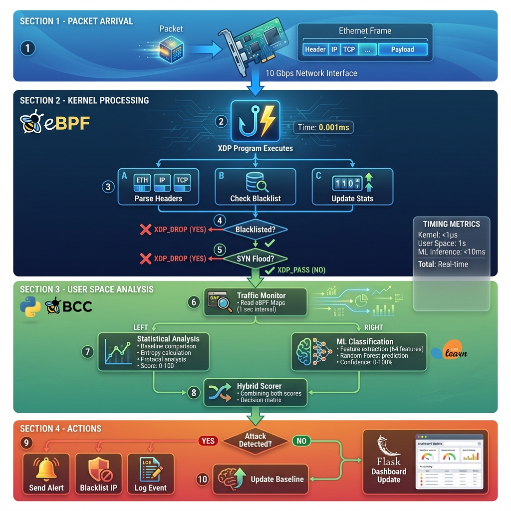
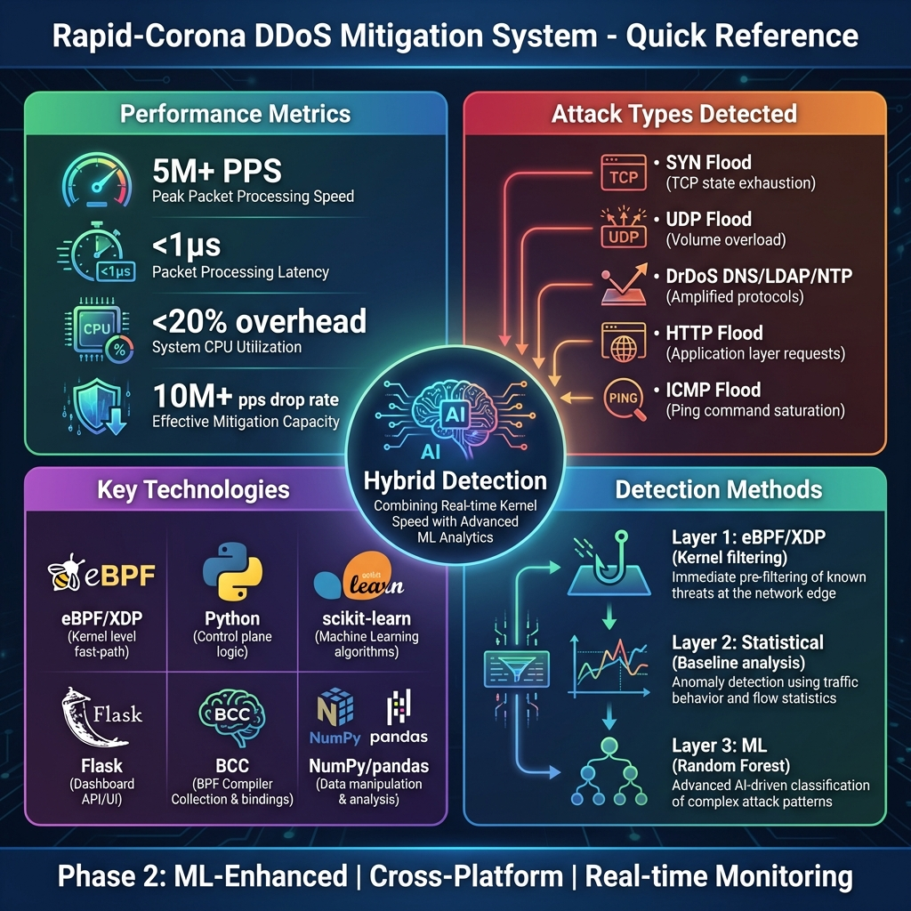

# 📚 Rapid-Corona DDoS Mitigation System - Documentation Index

Welcome to the complete documentation for the Rapid-Corona DDoS Mitigation System! This index will guide you to the right documentation based on your needs.

---

## 🎯 Quick Navigation

### 👋 **New to the Project?**
Start here:
1. **[README.md](README.md)** - Project overview and quick start
2. **[quick_reference_overview.png](quick_reference_overview.png)** - Visual summary
3. **[system_architecture_diagram.png](system_architecture_diagram.png)** - System architecture

### 💻 **Want to Use the System?**
Follow this path:
1. **[USAGE_GUIDE.md](USAGE_GUIDE.md)** - Complete usage instructions
2. **[README.md](README.md)** - Installation steps
3. **[packet_processing_flowchart.png](packet_processing_flowchart.png)** - How it works

### 🔧 **Developing or Contributing?**
Essential resources:
1. **[projectexplained.md](projectexplained.md)** - Complete technical documentation
2. **[DIAGRAMS.md](DIAGRAMS.md)** - All architecture diagrams explained
3. **[technology_stack_layers.png](technology_stack_layers.png)** - Technology stack
4. **[complete_data_journey.png](complete_data_journey.png)** - Data flow

### 🎓 **Learning About the Technology?**
Deep dives:
1. **[projectexplained.md](projectexplained.md)** - eBPF, XDP, ML explained
2. **[ml_detection_pipeline.png](ml_detection_pipeline.png)** - ML pipeline
3. **[detection_decision_tree.png](detection_decision_tree.png)** - Detection logic

---

## 📖 Documentation Files

### Core Documentation

| File | Purpose | Audience |
|------|---------|----------|
| **[README.md](README.md)** | Project overview, quick start, basic setup | Everyone |
| **[USAGE_GUIDE.md](USAGE_GUIDE.md)** | Detailed usage instructions, CLI options, configuration | Users, Operators |
| **[projectexplained.md](projectexplained.md)** | Complete technical documentation, all modules explained | Developers, Researchers |
| **[DIAGRAMS.md](DIAGRAMS.md)** | All diagrams with detailed explanations | Developers, Architects |
| **[VISUAL_DOCS.md](VISUAL_DOCS.md)** | Quick access to all visual documentation | Everyone |

### Configuration Files

| File | Purpose |
|------|---------|
| **[config.py](config.py)** | System configuration and thresholds |
| **[requirements.txt](requirements.txt)** | Python dependencies |

### Setup Scripts

| File | Platform | Purpose |
|------|----------|---------|
| **[setup_ebpf.sh](setup_ebpf.sh)** | Linux | Install eBPF dependencies |
| **[setup_ebpf.ps1](setup_ebpf.ps1)** | Windows | Install Microsoft eBPF |

---

## 🎨 Visual Documentation

### Architecture Diagrams

| Diagram | Description | Best For |
|---------|-------------|----------|
|  **System Architecture** | Complete system overview with all layers | Understanding overall design |
|  **Technology Stack** | Five-layer architecture with logos | Learning technologies used |
|  **Packet Processing** | Detailed packet flow through system | Debugging, optimization |
|  **ML Pipeline** | Machine learning detection process | Understanding ML integration |
|  **Decision Tree** | Hybrid detection logic and scoring | Understanding detection logic |
|  **Sequence Diagram** | Temporal flow with precise timing | Performance analysis |
|  **Data Journey** | End-to-end packet processing | Complete understanding |
|  **Quick Reference** | Key metrics and features at a glance | Quick overview |

---

## 🗂️ Project Structure

```
rapid-corona/
│
├── 📄 Documentation
│   ├── README.md                          # Project overview
│   ├── USAGE_GUIDE.md                     # Usage instructions
│   ├── projectexplained.md                # Complete technical docs
│   ├── DIAGRAMS.md                        # Diagram explanations
│   ├── VISUAL_DOCS.md                     # Visual docs index
│   └── DOCUMENTATION_INDEX.md             # This file
│
├── 🎨 Visual Documentation (PNG files)
│   ├── system_architecture_diagram.png
│   ├── packet_processing_flowchart.png
│   ├── ml_detection_pipeline.png
│   ├── technology_stack_layers.png
│   ├── detection_decision_tree.png
│   ├── realtime_sequence_diagram.png
│   ├── complete_data_journey.png
│   └── quick_reference_overview.png
│
├── 🐍 Python Source Code
│   ├── main.py                            # Main application
│   ├── config.py                          # Configuration
│   ├── attack_simulator.py                # Attack simulation
│   └── src/                               # Source modules
│       ├── traffic_monitor.py
│       ├── anomaly_detector.py
│       ├── dashboard.py
│       ├── alert_system.py
│       ├── traffic_profiler.py
│       ├── metrics_collector.py
│       ├── ebpf/                          # eBPF programs
│       │   ├── xdp_filter.c
│       │   ├── xdp_maps.h
│       │   └── Makefile
│       └── ml/                            # ML module
│           ├── ml_classifier.py
│           ├── feature_extractor.py
│           ├── data_loader.py
│           └── model_trainer.py
│
├── 🧪 Testing
│   └── tests/
│       ├── test_detector.py
│       ├── test_ml_classifier.py
│       ├── test_feature_extractor.py
│       └── benchmark.py
│
├── 📊 Data & Models
│   ├── data/
│   │   ├── models/                        # Trained ML models
│   │   ├── cic-ddos-2019/                 # Dataset (user-provided)
│   │   └── traffic_profile.json           # Learned baseline
│   └── logs/                              # Log files
│
└── ⚙️ Configuration
    ├── requirements.txt                   # Python dependencies
    ├── setup_ebpf.sh                      # Linux setup
    └── setup_ebpf.ps1                     # Windows setup
```

---

## 🎓 Learning Paths

### Path 1: Quick Start (30 minutes)
1. Read **README.md** (5 min)
2. View **quick_reference_overview.png** (2 min)
3. View **system_architecture_diagram.png** (5 min)
4. Follow setup in **USAGE_GUIDE.md** (15 min)
5. Run the system (5 min)

### Path 2: Understanding the System (2 hours)
1. Read **README.md** (10 min)
2. Study all diagrams in **DIAGRAMS.md** (30 min)
3. Read **projectexplained.md** sections:
   - Project Overview (15 min)
   - Core Technologies (30 min)
   - Architecture & Design (20 min)
   - Key Components (15 min)

### Path 3: Deep Technical Dive (1 day)
1. Complete Path 2 (2 hours)
2. Read **projectexplained.md** completely (3 hours)
3. Study source code with diagrams (2 hours)
4. Review **USAGE_GUIDE.md** for all features (1 hour)
5. Run tests and benchmarks (2 hours)

### Path 4: Development & Contribution (Ongoing)
1. Complete Path 3 (1 day)
2. Set up development environment
3. Study eBPF programs in `src/ebpf/`
4. Understand ML pipeline in `src/ml/`
5. Review test cases in `tests/`
6. Make contributions

---

## 🔍 Finding Information

### By Topic

**eBPF/XDP Technology**
- **projectexplained.md** → Section: "eBPF/XDP Technology"
- **system_architecture_diagram.png** → Kernel Space layer
- **packet_processing_flowchart.png** → XDP processing flow

**Machine Learning**
- **projectexplained.md** → Section: "Machine Learning Integration"
- **ml_detection_pipeline.png** → Complete ML pipeline
- **detection_decision_tree.png** → Hybrid detection logic

**Performance**
- **USAGE_GUIDE.md** → Section: "Performance Expectations"
- **quick_reference_overview.png** → Performance metrics quadrant
- **realtime_sequence_diagram.png** → Timing information

**Configuration**
- **USAGE_GUIDE.md** → Section: "Configuration"
- **config.py** → All configuration classes
- **projectexplained.md** → Configuration explanation

**Troubleshooting**
- **USAGE_GUIDE.md** → Section: "Troubleshooting"
- **packet_processing_flowchart.png** → Debug packet drops
- **realtime_sequence_diagram.png** → Identify timing issues

---

## 🚀 Common Tasks

### Installing the System
1. Check **README.md** → Quick Start section
2. Follow **USAGE_GUIDE.md** → Installation steps
3. Run setup script for your platform

### Running the System
```bash
# Basic usage
sudo python3 main.py --interface eth0 --dashboard

# With ML
sudo python3 main.py --interface eth0 --ml-model data/models/ddos_classifier.joblib --dashboard
```
See **USAGE_GUIDE.md** for all options.

### Training ML Model
```bash
# With synthetic data
python3 -m src.ml.model_trainer train --synthetic

# With CIC-DDoS-2019 dataset
python3 -m src.ml.model_trainer train --data-path data/cic-ddos-2019/
```
See **USAGE_GUIDE.md** → "Phase 2: ML Classification"

### Simulating Attacks
```bash
# UDP flood
python3 attack_simulator.py --type udp --target 127.0.0.1 --duration 30 --pps 1000

# SYN flood
python3 attack_simulator.py --type tcp --target 192.168.1.100 --port 80
```
See **USAGE_GUIDE.md** → "Traffic Simulation"

### Viewing Dashboard
1. Start system with `--dashboard` flag
2. Open browser to `http://localhost:5000`
3. See **dashboard.py** for API endpoints

---

## 📊 Key Metrics & Specifications

### Performance Targets
- **Throughput**: 5M+ packets per second
- **Latency**: <1μs per packet (kernel)
- **Detection**: <1 second for attacks
- **ML Inference**: <10ms per prediction
- **CPU Overhead**: <20% at 5M pps

### Attack Types Detected
- SYN Flood (TCP state exhaustion)
- UDP Flood (volumetric overload)
- DrDoS DNS/LDAP/NTP (amplification)
- HTTP Flood (application layer)
- ICMP Flood (ping saturation)

### Technologies Used
- **Kernel**: Linux Kernel 4.18+, eBPF, XDP
- **Data Plane**: BCC, C programming
- **Control Plane**: Python 3.8+, NumPy, SciPy, pandas
- **ML**: scikit-learn, Random Forest, joblib
- **Dashboard**: Flask, HTML/CSS/JavaScript
- **Monitoring**: psutil

---

## 🤝 Contributing

### Before Contributing
1. Read **projectexplained.md** completely
2. Understand architecture from **DIAGRAMS.md**
3. Review existing code and tests
4. Check open issues

### Areas for Contribution
- Additional attack detection algorithms
- Performance optimizations
- Cross-platform support improvements
- Documentation enhancements
- Test coverage expansion
- New ML models

---

## 📞 Support & Resources

### Documentation
- **Complete Docs**: [projectexplained.md](projectexplained.md)
- **Usage Guide**: [USAGE_GUIDE.md](USAGE_GUIDE.md)
- **Diagrams**: [DIAGRAMS.md](DIAGRAMS.md)

### External Resources
- [eBPF Documentation](https://ebpf.io/)
- [XDP Tutorial](https://github.com/xdp-project/xdp-tutorial)
- [BCC Reference](https://github.com/iovisor/bcc)
- [CIC-DDoS-2019 Dataset](https://www.unb.ca/cic/datasets/ddos-2019.html)
- [scikit-learn Docs](https://scikit-learn.org/)

---

## 📝 Version Information

- **Project Version**: Phase 2 (ML-Enhanced Detection)
- **Documentation Version**: 1.0
- **Last Updated**: January 12, 2026
- **Total Documentation Files**: 5 markdown files
- **Total Diagrams**: 8 PNG images
- **Total Pages**: ~100+ pages of documentation

---

## 🎯 Next Steps

### For New Users
1. ✅ Read this index
2. ✅ Review **README.md**
3. ✅ View **quick_reference_overview.png**
4. ⏭️ Follow **USAGE_GUIDE.md** to install
5. ⏭️ Run the system and explore dashboard

### For Developers
1. ✅ Read this index
2. ✅ Study **projectexplained.md**
3. ✅ Review all diagrams in **DIAGRAMS.md**
4. ⏭️ Explore source code
5. ⏭️ Run tests and benchmarks
6. ⏭️ Start contributing

### For Researchers
1. ✅ Read this index
2. ✅ Study **projectexplained.md** → ML sections
3. ✅ Review **ml_detection_pipeline.png**
4. ⏭️ Analyze ML model performance
5. ⏭️ Experiment with different algorithms
6. ⏭️ Publish findings

---

**Welcome to Rapid-Corona DDoS Mitigation System!** 🛡️

We hope this documentation helps you understand, use, and contribute to the project. Happy coding! 🚀

---

*For questions, issues, or contributions, please refer to the appropriate documentation file above.*
